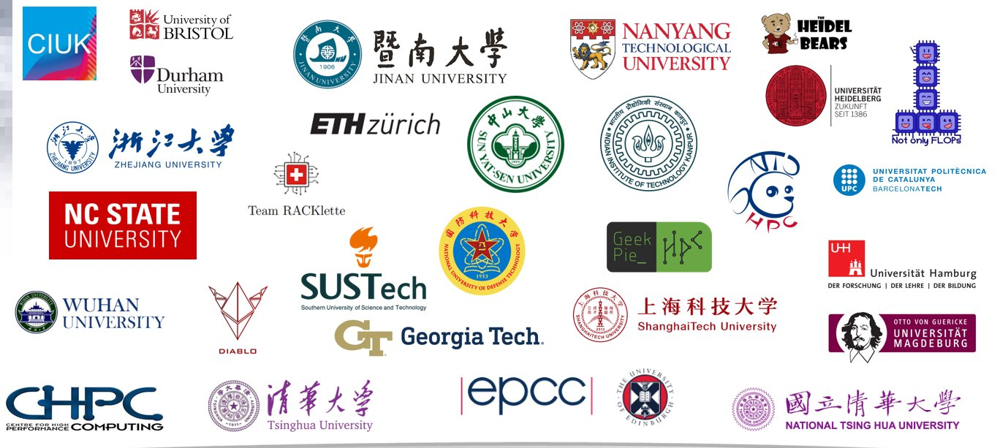

The ISC Student Cluster Competition (SCC) is an annual supercomputing competition that focuses on the HPC community's future generation. 
The IIT Kanpur team. 'ExaDecimals', is a group of third year undergraduate students from the Department of Computer Science and Engineering. The team is mentored by Dr. Preeti Malakar and Dr. Swarnendu Biswas, who are very knowledgeable in the field of HPC and have guided the team through the competition. 

<!-- Insert image -->

Our team was selected to participate in the 2024 ISC Student Cluster Competition, in the virtual round. We submitted are proposal on October last year and were selected to participate in the competition. We were one of the first Indian team to participate in the competition, and also one of the very few first time participants. We were competing agaisnt top Universities from all over the world, and had very less experience in the field of HPC. However, we were determined to learn and compete with the best.

## Preparation Phase
Our early preperations started with learning about building, running, profiling and visualizing applications in the local CSE beouwulf cluster, then followed by Param Sanganak, our in house Supercomputer. We initially started with trying out the tasks given in the previous years. 
## Competition Overview

The competition was 2 months long and began in March. We were given 4 tasks to complete which covered a wide range of topics, including parallelization, optimizations, scaling, profiling and visualization.

### Tasks Overview
<!-- List of tasks -->
1. **Parallelization and Optimization of ICON Model:**
The first task was to parallelize and optimize the standalone microphysics module of the ICON model. We were alloted OpenACC to parallelize the code and make it compatible with the NVIDIA GPUs. We had to optimize the code to run on the DKRZ Supercomputer, which is rank 60 in the Top500 list. Our initial efforts were just to run the code on GPU and get the output. We then started optimizing the code by using the OpenACC directives and by performing loop reorderings, breaking loops, etc. We were able to achieve a speedup of 20x over the CPU version of the code, and maintaining correctness.

2. **Profiling and Optimization of RegCM:**
The second task was to run, profile and visualize the runs of RegCM for the given dataset. We were asked to run this on the Pittsburgh Supercomputing Center's Bridges-2 Supercomputer. We also attempted the bonus task of optimizing the microphysics module of the RegCM model. We obtained a speedup of 23% over the baseline code and submitted a pull request to the RegCM repository. This bonus task was completed by a very few teams and ours was the best among the visible pull requests by a very large margin.
3. **Analysis and Optimization of Conquest Application:**
The third task was to analyze and find the best configuration of OpenMP threads and MPI processes for the Conquest application. We were also asked to profile the application. Our team also performed weak scaling and strong scaling experiments on the application.

4. **Profiling and Visualization of NekoCFD:**
The final task was to run, profile and visualise the NekoCFD code with CPU and GPU backends. This was also run on the Bridges-2 Supercomputer. We ran the code for different configurations and visualized the results using Paraview.

Overall the competition was a great learning experience for us. We learned a lot about HPC, parallelization, optimizations, profiling and visualization. We also learned about the importance of teamwork, communication and time management. We were able to complete all the tasks and submit the final report on time. We are eagerly waiting for the results of the competition and hope to participate in the next edition of the competition.
